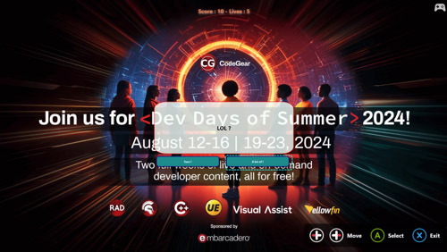

# Make games in Delphi (2024 edition) - Dev Days of Summer 2024

[This page in English.](README.md)

Ce dépôt contient les slides ([FR](slides-FR/) / [EN](slides-EN/)), les PDF ([FR](MakeGamesInDelphi2024Edition-FR.pdf) / [EN](MakeGamesInDelphi2024Edition-EN.pdf)) et les jeux vidéo de démo réalisés pour la présentation "Make games in Delphi (2024 edition)" de Patrick Prémartin lors des [Dev Days of Summer 2024](https://www.codegear.com/DevDaysofSummer/) organisés par [Embarcadero](https://www.embarcadero.com).

Cette session fut l'occasion de rappeler l'intérêt pour tout développeur (avec ou sans expérience) de se mettre à la création de jeux vidéos (par exemple sur des week-ends de [game jam](https://itch.io/jams)). C'est une bonne façon de se mettre à niveau sur des fonctionnalités qu'on utilise peu dans les développements du quotidien et d'appliquer ensuite ces compétences aux projets "plus serieux" qui eux aussi ont besoin de réactivité et d'interfaces utilisateurs intuitives.

Plusieurs dépôts de code ([Delphi Game Engine](https://github.com/DeveloppeurPascal/Delphi-Game-Engine), [Gamolf FMX Game Starter Kit](https://github.com/DeveloppeurPascal/Gamolf-FMX-Game-Starter-Kit)) permettent de travailler sans moteur de jeu mais en ne partant pas totalement de rien. Ca laisse au développeur la maîtrise de ce qu'il veut faire tout en retirant la monotonie du fonctionnement de base : écrans, traductions, paramétrages du programme et des parties, prise en charge de la musique et utilisation des contrôleurs de jeux pour manipuler l'interface utilisateur.

Delphi permet de tout faire, même des jeux, profitez-en !

Ce dépôt de code contient un projet développé en langage Pascal Objet sous Delphi. Vous ne savez pas ce qu'est Dephi ni où le télécharger ? Vous en saurez plus [sur ce site web](https://delphi-resources.developpeur-pascal.fr/).

## Présentations et conférences

### Dev Days of Summer 2024

* la rediffusion est pour bientôt

### Twitch

Suivez mes streams de développement de logiciels, jeux vidéo, applications mobiles et sites web sur [ma chaîne Twitch](https://www.twitch.tv/patrickpremartin) ou en rediffusion sur [Serial Streameur](https://serialstreameur.fr/dev-days-of-summer-2024.html) la plupart du temps en français.

## Exemples de projets

### The Quiz

Ce programme est un simple jeu de quiz avec un générateur de questions.

Les codes sources sont dans [ce dossier](samples/TheQuiz).

Des installeurs sont disponibles si vous voulez le tester sans devoir compiler le projet :

* [Windows 32 bits](samples-installers/DDoS2024QuizSample-Win32-setup.zip)
* [Windows 64 bits](samples-installers/DDoS2024QuizSample-Win64-setup.zip)
* [macOS à processeur Intel](samples-installers/DDoS2024QuizSample-MacIntel.zip)
* [macOS à processeur Apple Silicon M1 et suivants](samples-installers/DDoS2024QuizSample-MacM1.zip)

## Installation des codes sources

Pour télécharger ce dépôt de code il est recommandé de passer par "git" mais vous pouvez aussi télécharger un ZIP directement depuis [son dépôt GitHub](https://github.com/DeveloppeurPascal/DevDaysOfSummer2024-MakeGamesInDelphi).

Ce projet utilise des dépendances sous forme de sous modules. Ils seront absents du fichier ZIP. Vous devrez les télécharger à la main.

* [DeveloppeurPascal/AboutDialog-Delphi-Component](https://github.com/DeveloppeurPascal/AboutDialog-Delphi-Component) doit être installé dans le sous dossier ./lib-externes/AboutDialog-Delphi-Component
* [DeveloppeurPascal/Delphi-Game-Engine](https://github.com/DeveloppeurPascal/Delphi-Game-Engine) doit être installé dans le sous dossier ./lib-externes/Delphi-Game-Engine
* [DeveloppeurPascal/Gamolf-FMX-Game-Starter-Kit](https://github.com/DeveloppeurPascal/Gamolf-FMX-Game-Starter-Kit) doit être installé dans le sous dossier ./lib-externes/Gamolf-FMX-Game-Starter-Kit
* [DeveloppeurPascal/librairies](https://github.com/DeveloppeurPascal/librairies) doit être installé dans le sous dossier ./lib-externes/librairies

## Compatibilité

En tant que [MVP Embarcadero](https://www.embarcadero.com/resources/partners/mvp-directory) je bénéficie dès qu'elles sortent des dernières versions de [Delphi](https://www.embarcadero.com/products/delphi) et [C++ Builder](https://www.embarcadero.com/products/cbuilder) dans [RAD Studio](https://www.embarcadero.com/products/rad-studio). C'est donc dans ces versions que je travaille.

Normalement mes librairies et composants doivent aussi fonctionner au moins sur la version en cours de [Delphi Community Edition](https://www.embarcadero.com/products/delphi/starter).

Aucune garantie de compatibilité avec des versions antérieures n'est fournie même si je m'efforce de faire du code propre et ne pas trop utiliser les nouvelles façons d'écrire dedans (type inference, inline var et multilines strings).

Si vous détectez des anomalies sur des versions antérieures n'hésitez pas à [les rapporter](https://github.com/DeveloppeurPascal/DevDaysOfSummer2024-MakeGamesInDelphi/issues) pour que je teste et tente de corriger ou fournir un contournement.

## Licence d'utilisation de ce dépôt de code et de son contenu

Ces codes sources sont distribués sous licence [AGPL 3.0 ou ultérieure](https://choosealicense.com/licenses/agpl-3.0/).

Vous êtes globalement libre d'utiliser le contenu de ce dépôt de code n'importe où à condition :
* d'en faire mention dans vos projets
* de diffuser les modifications apportées aux fichiers fournis dans ce projet sous licence AGPL (en y laissant les mentions de copyright d'origine (auteur, lien vers ce dépôt, licence) obligatoirement complétées par les vôtres)
* de diffuser les codes sources de vos créations sous licence AGPL

Si cette licence ne convient pas à vos besoins vous pouvez acheter un droit d'utilisation de ce projet sous la licence [Apache License 2.0](https://choosealicense.com/licenses/apache-2.0/) ou une licence commerciale dédiée ([contactez l'auteur](https://developpeur-pascal.fr/nous-contacter.php) pour discuter de vos besoins).

Ces codes sources sont fournis en l'état sans garantie d'aucune sorte.

Certains éléments inclus dans ce dépôt peuvent dépendre de droits d'utilisation de tiers (images, sons, ...). Ils ne sont pas réutilisables dans vos projets sauf mention contraire.

## Comment demander une nouvelle fonctionnalité, signaler un bogue ou une faille de sécurité ?

Si vous voulez une réponse du propriétaire de ce dépôt la meilleure façon de procéder pour demander une nouvelle fonctionnalité ou signaler une anomalie est d'aller sur [le dépôt de code sur GitHub](https://github.com/DeveloppeurPascal/DevDaysOfSummer2024-MakeGamesInDelphi) et [d'ouvrir un ticket](https://github.com/DeveloppeurPascal/DevDaysOfSummer2024-MakeGamesInDelphi/issues).

Si vous avez trouvé une faille de sécurité n'en parlez pas en public avant qu'un correctif n'ait été déployé ou soit disponible. [Contactez l'auteur du dépôt en privé](https://developpeur-pascal.fr/nous-contacter.php) pour expliquer votre trouvaille.

Vous pouvez aussi cloner ce dépôt de code et participer à ses évolutions en soumettant vos modifications si vous le désirez. Lisez les explications dans le fichier [CONTRIBUTING.md](CONTRIBUTING.md).

## Supportez ce projet et son auteur

Si vous trouvez ce dépôt de code utile et voulez le montrer, merci de faire une donation [à son auteur](https://github.com/DeveloppeurPascal). Ca aidera à maintenir le projet (codes sources et binaires).

Vous pouvez utiliser l'un de ces services :

* [GitHub Sponsors](https://github.com/sponsors/DeveloppeurPascal)
* [Liberapay](https://liberapay.com/PatrickPremartin)
* [Patreon](https://www.patreon.com/patrickpremartin)
* [Paypal](https://www.paypal.com/paypalme/patrickpremartin)

ou si vous parlez français vous pouvez [vous abonner à Zone Abo](https://zone-abo.fr/nos-abonnements.php) sur une base mensuelle ou annuelle et avoir en plus accès à de nombreuses ressources en ligne (vidéos et articles).
